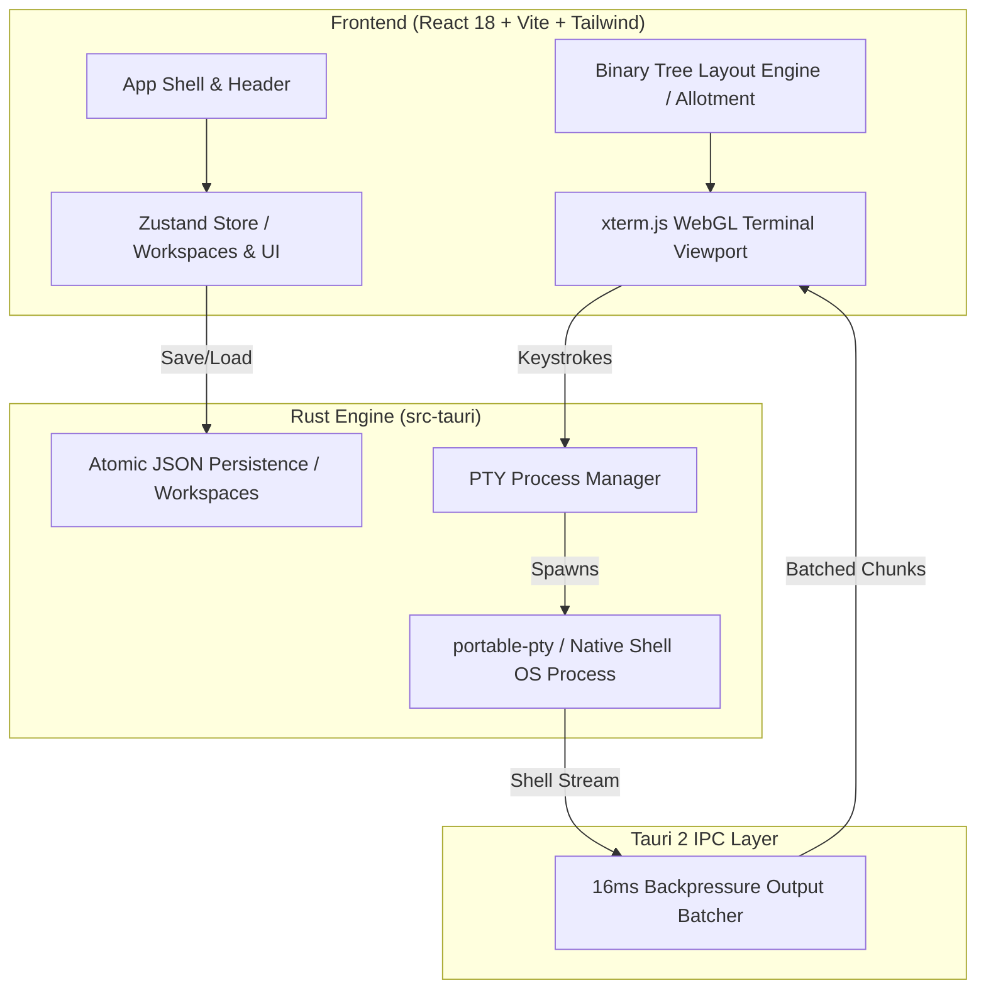

<div align="center">

  

  # VibeGrid ⚡

  ### The lightning-fast, free, local-first grid for orchestrating YOUR choice of AI agents.

  [](LICENSE)
  [](https://www.rust-lang.org/)
  [](https://tauri.app/)
  [](https://xtermjs.org/)
  [](https://github.com/vibegrid/vibegrid/releases)
  [](#)

  <p align="center">
    <a href="http://localhost:3000"><strong>Explore Marketing Website »</strong></a>
    <br />
    <br />
    <a href="#-quick-start">Quick Start</a>
    ·
    <a href="#-key-features">Key Features</a>
    ·
    <a href="#-architecture">Architecture</a>
    ·
    <a href="#-keyboard-shortcuts">Keybindings</a>
    ·
    <a href="#-contributing">Contributing</a>
  </p>

</div>

---

## 📖 Overview

**VibeGrid** is the definitive "Agnostic" Vibe Coder. It is a high-performance, open-source desktop application designed for developers orchestrating multiple terminal shells, background services, and AI coding agents simultaneously. 

Unlike BridgeSpace's restrictive "walled garden", VibeGrid gives you the ultimate freedom to orchestrate **YOUR choice of AI agents** locally, without lock-in. Experience true "vibe coding" with a workspace built for speed, privacy, and unrestricted agent collaboration.

Built with **Tauri 2**, **Rust**, **React 18**, **TypeScript**, and **xterm.js WebGL GPU acceleration**, VibeGrid delivers sub-10ms keystroke latency, 60 FPS output streaming, and dynamic binary-tree multi-pane multiplexing for **1 to 16 live panes**.

> **100% Open Source & Free Forever**: No subscriptions, no telemetry, no mandatory accounts, and no paid feature walls.

---

## ✨ Key Features

- **⚡ 60 FPS WebGL GPU Rendering**: Powered by `@xterm/addon-webgl` for buttery smooth text rendering and 5,000-line scrollback buffer with automatic Canvas 2D fallback.
- **🦀 Native Rust PTY Engine**: Sub-10ms keystroke latency using `portable-pty` with a 16ms backpressure-aware IPC batcher to prevent terminal output locks under high volume.
- **⊞ Dynamic 1–16 Pane Grid**: Binary-tree layout multiplexer (`allotment`) supporting horizontal splits (`Cmd/Ctrl+D`), vertical splits (`Cmd/Ctrl+Shift+D`), drag-to-resize dividers, and single-pane focus maximization (`Cmd/Ctrl+Shift+Enter`).
- **💾 Workspaces System**: Create, switch (`Cmd/Ctrl+Shift+Left/Right`), rename, and persist custom workspace environments stored in atomic JSON files on disk.
- **⌨️ Command Palette (Cmd/Ctrl+Shift+P)**: Fuzzy search across all actions, keybindings, layout presets, workspaces, and theme selections in a unified modal interface.
- **🎨 7 Built-in Themes**: VibeDark, VibeLight, Midnight Blue, Solarized Dark, Solarized Light, Dracula, Nord — complete with custom font and keybinding editors.
- **🛡️ Privacy First & 100% Offline**: 100% local desktop process with zero telemetry, zero analytics tracking, and full offline operation.

---

## 🏗️ Architecture



---

## 🛠️ Tech Stack

| Domain | Technology | Description |
|---|---|---|
| **App Shell** | [Tauri v2](https://tauri.app/) | Cross-platform Rust desktop runtime (<40MB binary size) |
| **Backend Engine** | [Rust](https://www.rust-lang.org/) | Async PTY manager, Tokio, `portable-pty`, Serde JSON |
| **Frontend Framework** | [React 18](https://react.dev/) + [TypeScript](https://www.typescriptlang.org/) | Type-safe modular UI system built with Vite |
| **Terminal Core** | [xterm.js](https://xtermjs.org/) | WebGL GPU renderer, WebLinks, Search, Fit addons |
| **Layout Engine** | [Allotment](https://github.com/johnwalley/allotment) | Dynamic recursive binary-tree split pane layout |
| **State Management** | [Zustand](https://zustand-demo.pmnd.rs/) | Minimalist persistent application state store |
| **Styling & Motion** | [Tailwind CSS](https://tailwindcss.com/) + [Framer Motion](https://www.framer.com/motion/) | Modern dark glassmorphism design system & micro-animations |

---

## 🚀 Quick Start

### System Requirements

- **Node.js**: v18.0.0 or higher
- **Rust**: v1.75.0 or higher
- **Build Tools**:
  - **macOS**: Xcode Command Line Tools (`xcode-select --install`)
  - **Windows**: C++ Build Tools via Visual Studio Installer

### Installation

1. **Clone the Repository**:
   ```bash
   git clone https://github.com/vibegrid/vibegrid.git
   cd vibegrid
   ```

2. **Install Dependencies**:
   ```bash
   npm install
   ```

3. **Run Desktop App in Development Mode**:
   ```bash
   npm run tauri dev
   ```

4. **Run Marketing Web App**:
   ```bash
   cd website
   npm install
   npm run dev
   ```
   Open [http://localhost:3000](http://localhost:3000) to view the marketing site.

5. **Build Production Desktop Binary**:
   ```bash
   npm run tauri build
   ```

---

## ⌨️ Keyboard Shortcuts

| Category | Shortcut (macOS / Win) | Description |
|---|---|---|
| **Pane Splitting** | `Cmd/Ctrl + D` | Split current pane horizontally |
| **Pane Splitting** | `Cmd/Ctrl + Shift + D` | Split current pane vertically |
| **Pane Control** | `Cmd/Ctrl + W` | Close focused pane |
| **Pane Control** | `Cmd/Ctrl + Shift + Enter` | Maximize / restore focused pane |
| **Navigation** | `Cmd/Ctrl + Alt + Arrow` | Navigate focus to adjacent 2D pane |
| **Workspaces** | `Cmd/Ctrl + Shift + N` | Create a new workspace |
| **Workspaces** | `Cmd/Ctrl + Shift + Left/Right` | Switch between active workspaces |
| **Command Palette** | `Cmd/Ctrl + Shift + P` | Open Command Palette fuzzy search |
| **Settings** | `Cmd/Ctrl + ,` | Open Settings & Customization modal |
| **Sidebar** | `Cmd/Ctrl + B` | Toggle Workspaces sidebar |

---

## 📂 Repository Structure

```
VibeGrid/
├── src-tauri/             # Rust backend engine
│   ├── src/               # PTY manager, IPC commands, workspace storage
│   ├── icons/             # Platform icons (macOS .icns, Windows .ico, PNGs)
│   └── tauri.conf.json    # Tauri v2 configuration manifest
├── src/                   # Desktop React frontend
│   ├── components/        # Terminal, Header, WorkspaceSidebar, Modals
│   ├── store/             # Zustand state stores (panes, workspaces, UI)
│   └── types/             # TypeScript definitions
├── website/               # Next.js marketing web app
│   ├── app/               # App Router pages & globals.css
│   ├── components/        # ItsHover motion icons, Hero, Features, Parallax
│   └── public/            # Static assets & favicons
├── docs/                  # PRD, Architecture, and Deep Analysis documentation
├── LICENSE                # Official MIT Open Source License
└── README.md              # Project documentation
```

---

## 🤝 Contributing

Contributions are welcome from developers of all skill levels! Whether fixing a bug, adding a theme, or refining documentation:

1. Fork the project.
2. Create your feature branch (`git checkout -b feature/AmazingFeature`).
3. Commit your changes (`git commit -m 'Add some AmazingFeature'`).
4. Push to the branch (`git push origin feature/AmazingFeature`).
5. Open a Pull Request.

Please read our [License](LICENSE) and code of conduct before submitting PRs.

---

## 📄 License

This project is licensed under the **MIT License** — see the [LICENSE](LICENSE) file for details. Free and open-source software for everyone forever.

<div align="center">
  <br />
  <sub>Built with ❤️ and Rust for the open-source developer community.</sub>
</div>
